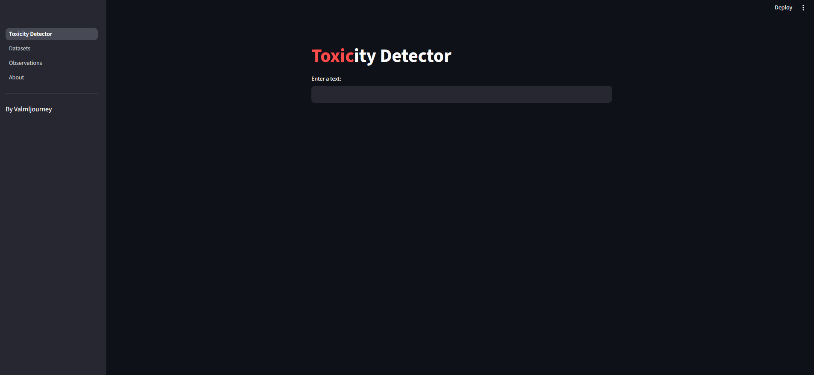
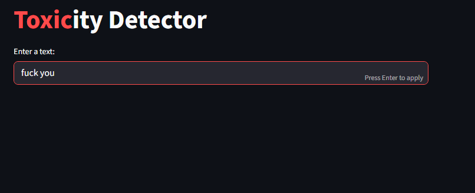
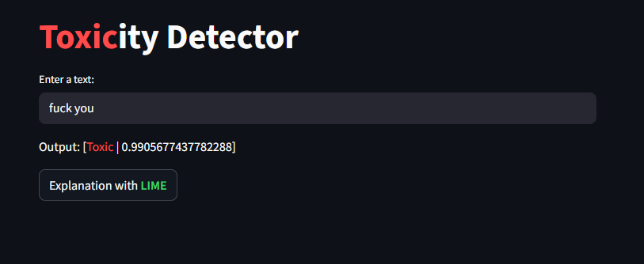
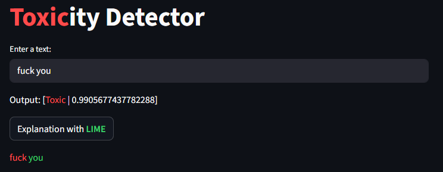

# Toxicity Detector

This is a toxicity detector that outputs whether or not the input is toxic along with its toxicity percentage.
This project learnt me a lot about fine-tuning a ML model.

## Visuals



## Requirements
- Python 3.13
- streamlit
- fastAPI
- pandas
- transformers
- lime

### Libraries Installation: Windows
```bash
Set-ExecutionPolicy -ExecutionPolicy RemoteSigned -Scope Process
# This line removes the powershell's restriction only for this terminal, in
# order to allow the activation of the virtual environment (venv).

python -m venv venv
.\venv\Scripts\activate
pip install -r requirements.txt
```

### Libraries Installation: Linux/MacOS
```bash
python -m venv venv
source venv/bin/activate
pip install -r requirements.txt
```


## Run the project

### Windows:
```bash
Set-ExecutionPolicy -ExecutionPolicy RemoteSigned -Scope Process
# This line removes the powershell's restriction only for this terminal, in
# order to allow the activation of the virtual environment (venv).

venv\Scripts\python -m uvicorn src.api:app --reload
```
In a new terminal:
```bash
Set-ExecutionPolicy -ExecutionPolicy RemoteSigned -Scope Process
# This line removes the powershell's restriction only for this terminal, in
# order to allow the activation of the virtual environment (venv).

venv\Scripts\python -m streamlit run Toxicity_Detector.py
```


### Linux/MacOS:
```bash
./venv/bin/python -m uvicorn src.api:app --reload
```
In a new terminal:
```bash
./venv/bin/python -m streamlit run Toxicity_Detector.py
```

## Usage
My app is divided into 4 sections:
- I. Toxicity Detector
- II. Datasets
- III. Observations
- IV. About

### I. Toxicity Detector
Type a message in the *'Enter a message'* textbox, and press **Enter**. You will see under the textbox the prediction of the ML model in the format [Toxic/Non-Toxic | Toxicity-Percentage].

**Example:** <br>
1) Type *'fuck you'*

2) Press **Enter**

And you can see the result.
3) Press the [Explanation with **LIME]** button

And you get the words responsible for flagging toxic highlighted in red, and the other words highlighted in green.


### II. Datasets

In that page you can see extracts of the datasets used for **training** and **testing** the ML Model. They both come from the [jigsaw-toxic-comment-classification-challenge](https://www.kaggle.com/competitions/jigsaw-toxic-comment-classification-challenge) on **Kaggle**.


### III. Observations

This page shows my entire journey of fine-tuning my ML Model:
- How I trained it at first
- How I improved the training
- The results of the training
- What can be improved


### IV. About

This page shows various informations about this project, like the improvement from my previous one.


## Author
valmljourney

## Have fun testing my Toxicity Detector!